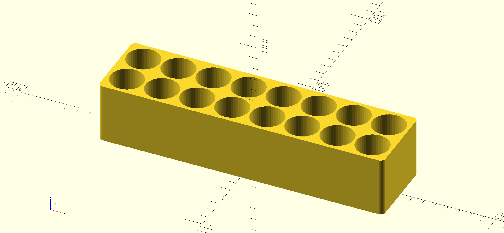

# bachi-holder

A simple stroage bin for my bachi collection modeled using OpenSCAD

https://www.printables.com/model/664111-taiko-bachi-holder/files



## How to build

If the command line executable `openscad` is available on your system, you can build the STLs using make

```
make
```
